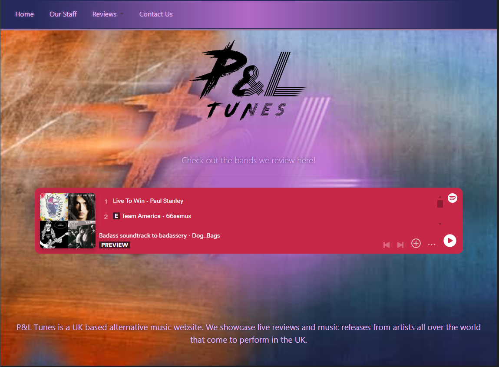
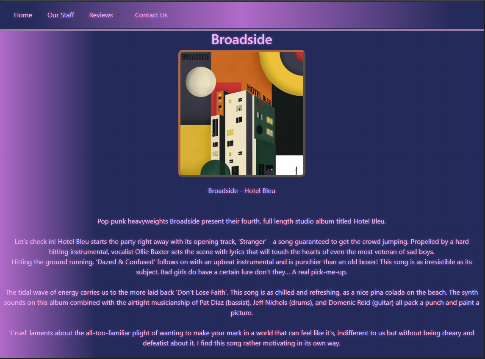
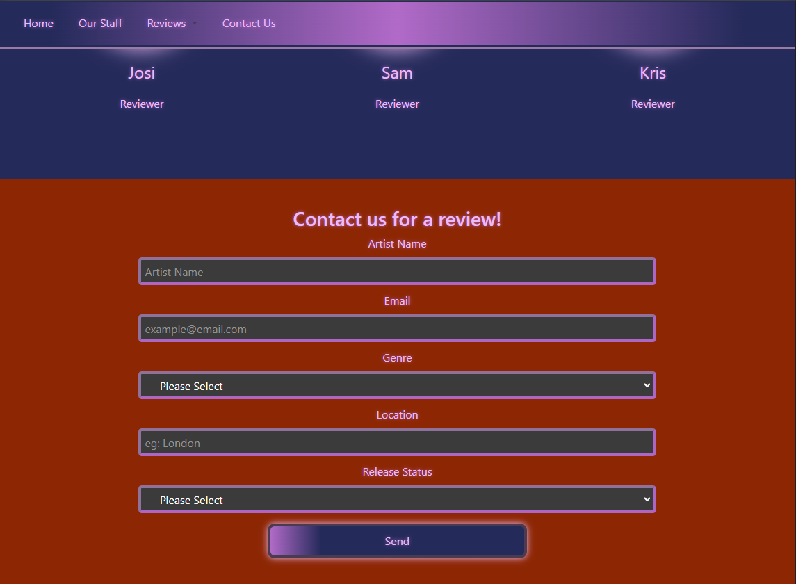
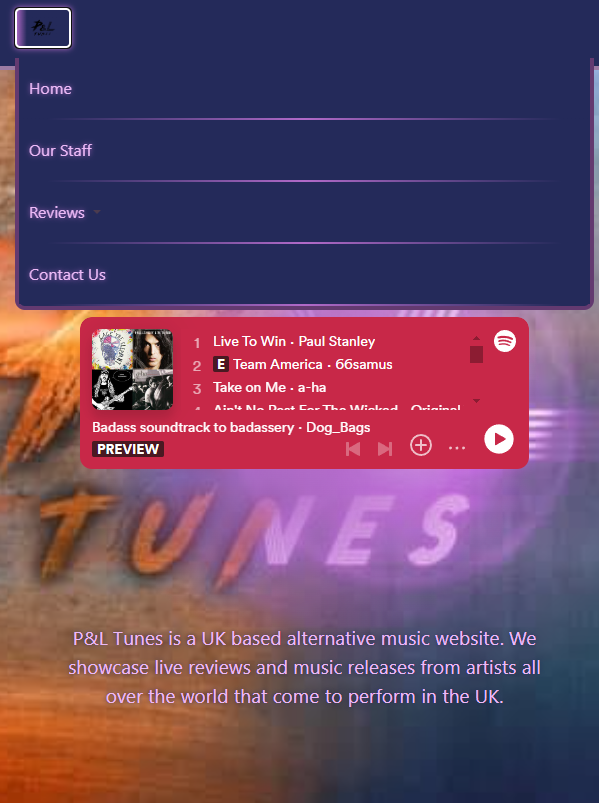

# P and L Tunes

This project was created for P&L Reviews, an alternative music review company based in the UK. The client requested a website to display their reviews, with functionality to allow sorting through the reviews and handling that data for users to browse and learn about artist releases and upcoming music. 

The site contains a navbar with local anchors to different sections of the page, a short bio, a review accordion to filter and select the reviews for each artist, as well as a staff section and contact form for artists to request reviews. 

## Front End

- HTML
- CSS
- JS
- BootstrapCSS

## Usage

N/A - Project is still in development

## Support

For support, please contact the dev team via: https://github.com/Jaycossey

## License

MIT - See license for details
